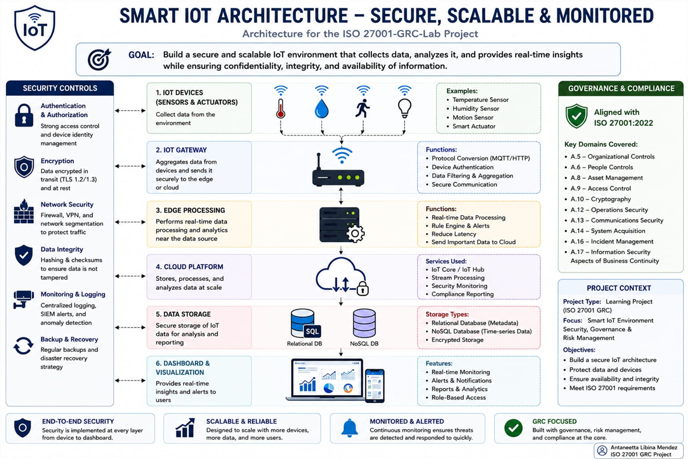
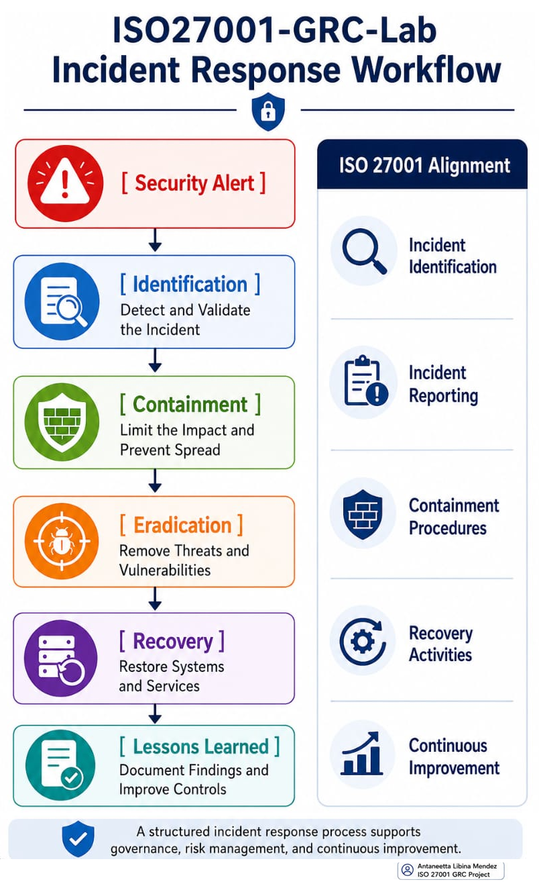
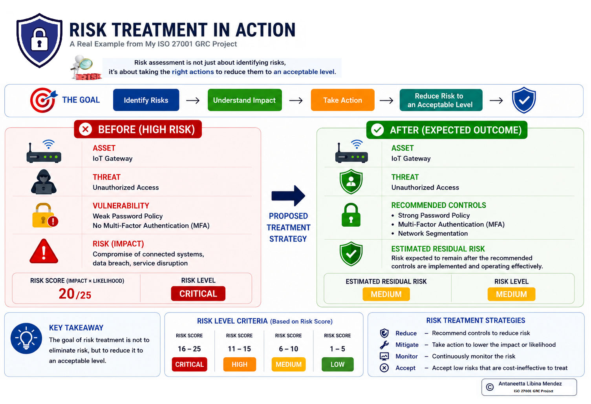
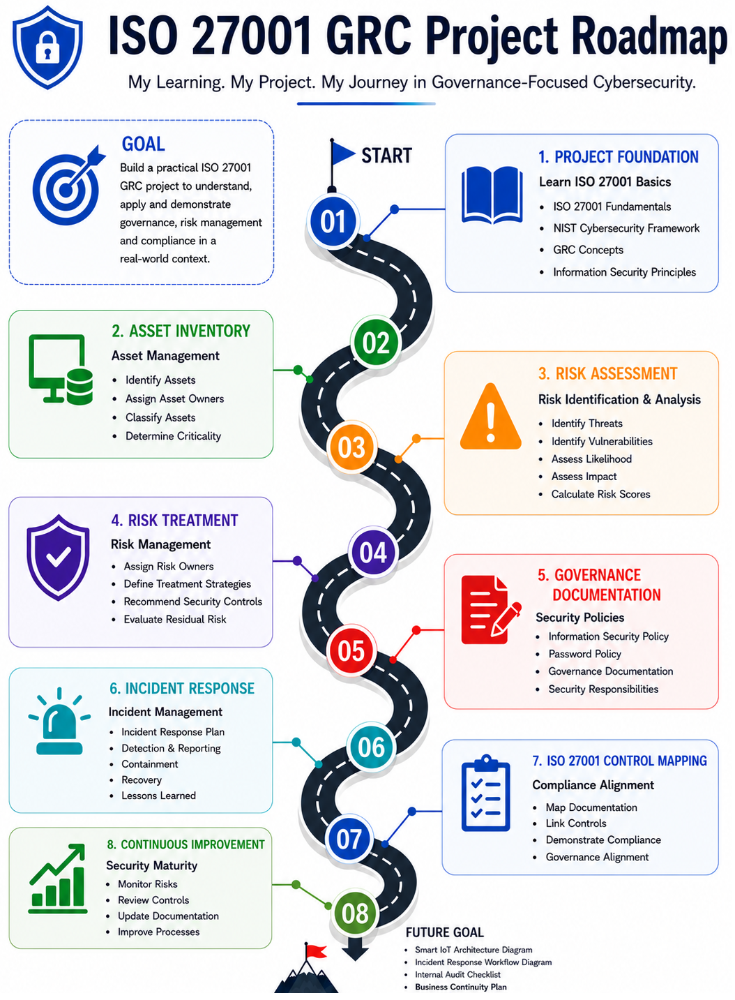

# 🛡️ ISO27001-GRC-Lab

## 📌 Project Overview

This project is a practical Governance, Risk & Compliance (GRC) lab that simulates an Information Security Management System (ISMS) for a smart IoT infrastructure environment.

The project applies ISO 27001:2022 and selected NIST Cybersecurity Framework (CSF) concepts to demonstrate practical cybersecurity governance, risk management, security documentation, control mapping, incident response, business continuity, privileged access management, and audit preparation.

The project is designed as a learning and portfolio environment and does not represent a live production ISMS or ISO 27001 certification.

---

## 🎯 Objectives

The objectives of this project are to:

- Perform cybersecurity risk assessments.
- Identify and classify information assets.
- Develop and maintain a risk register.
- Define risk treatment strategies.
- Develop information security policies and procedures.
- Document access management and privileged access controls.
- Develop incident response procedures.
- Develop business continuity and recovery documentation.
- Map selected security controls to ISO 27001:2022.
- Develop a Statement of Applicability (SoA).
- Prepare internal audit documentation.
- Improve traceability between security controls and supporting documentation.
- Demonstrate practical GRC and cybersecurity governance workflows.

---

## 📚 Frameworks & Standards

- ISO 27001:2022
- NIST Cybersecurity Framework (CSF)

---

## 📂 Project Structure

```text
ISO27001-GRC-Lab/
│
├── Assets/
│   └── Asset_Inventory.md
│
├── Audit_Checklist/
│   ├── Internal_Audit_Checklist.md
│   └── Internal_Audit_Report.md
│
├── Diagrams/
│   ├── ISO27001_GRC_Roadmap.png
│   ├── Incident_Response_Workflow.png
│   ├── Risk_Treatment_Example.png
│   └── Smart_IoT_Architecture.png
│
├── ISO27001_Controls/
│   ├── ISO27001_Control_Mapping.md
│   └── Statement_of_Applicability.md
│
├── Incident_Response/
│   └── Incident_Response_Plan.md
│
├── Policies/
│   ├── Business_Continuity_Plan.md
│   ├── Information_Security_Policy.md
│   ├── Password_Policy.md
│   └── Privileged_Access_Management_Procedure.md
│
├── Risk_Assessment/
│
├── .gitignore
├── LICENSE
└── README.md
```

---

## 🔍 Project Components

### 🖥️ Asset Inventory

The Asset Inventory identifies and classifies information assets within the simulated smart IoT environment.

Key areas include:

- Asset Identification
- Asset Ownership
- Asset Classification
- Asset Criticality Assessment

📄 [Asset Inventory](Assets/Asset_Inventory.md)

---

### ⚠️ Risk Assessment

The Risk Assessment component provides a structured approach for identifying, assessing, prioritizing, and treating cybersecurity risks.

Key areas include:

- Risk Assessment Methodology
- Risk Identification
- Threat Identification
- Vulnerability Analysis
- Risk Scoring
- Risk Register
- Risk Treatment
- Risk Ownership
- Residual Risk Considerations

📄 [Risk Assessment](Risk_Assessment/)

---

### 📋 Governance & Security Policies

The project includes documented governance and information security policies supporting the simulated ISMS.

Key documents include:

- Information Security Policy
- Password Policy
- Privileged Access Management Procedure
- Business Continuity Plan

📄 [Information Security Policy](Policies/Information_Security_Policy.md)

📄 [Password Policy](Policies/Password_Policy.md)

📄 [Privileged Access Management Procedure](Policies/Privileged_Access_Management_Procedure.md)

📄 [Business Continuity Plan](Policies/Business_Continuity_Plan.md)

---

### 🔐 Access & Privileged Access Management

The project documents security controls for managing user and administrator access within the simulated environment.

Key areas include:

- Access Control
- Identity Management
- Access Rights
- Least Privilege
- Need-to-Know
- Privileged Account Provisioning
- Administrator Account Management
- Periodic Privileged Access Reviews
- Access Revocation
- Multi-Factor Authentication (MFA)
- Privileged Activity Logging
- Monitoring
- Emergency Privileged Access

The Privileged Access Management Procedure supports selected ISO 27001:2022 controls related to access management, identity management, access rights, privileged access, authentication, logging, and monitoring.

📄 [Privileged Access Management Procedure](Policies/Privileged_Access_Management_Procedure.md)

---

### 🚨 Incident Response

The Incident Response component documents a structured approach for handling cybersecurity incidents.

Key areas include:

- Incident Identification
- Incident Reporting
- Incident Assessment
- Containment
- Eradication
- Recovery
- Lessons Learned
- Incident Response Workflow

📄 [Incident Response Plan](Incident_Response/Incident_Response_Plan.md)

---

### 🔄 Business Continuity

The Business Continuity Plan defines continuity and recovery strategies for critical services within the simulated environment.

Key areas include:

- Critical Business Services
- Recovery Priorities
- Backup Strategy
- Recovery Activities
- Roles and Responsibilities
- Communication During Disruptions
- Plan Maintenance

📄 [Business Continuity Plan](Policies/Business_Continuity_Plan.md)

---

### ✅ ISO 27001:2022 Control Mapping

The project maps selected ISO 27001:2022 Annex A controls to supporting governance and cybersecurity documentation.

Selected controls include:

- A.5.9 — Inventory of Information and Other Associated Assets
- A.5.15 — Access Control
- A.5.16 — Identity Management
- A.5.17 — Authentication Information
- A.5.18 — Access Rights
- A.5.24 — Information Security Incident Management Planning and Preparation
- A.5.30 — ICT Readiness for Business Continuity
- A.5.36 — Compliance with Policies, Rules and Standards for Information Security
- A.8.2 — Privileged Access Rights
- A.8.5 — Secure Authentication
- A.8.8 — Management of Technical Vulnerabilities
- A.8.15 — Logging
- A.8.16 — Monitoring Activities

📄 [ISO 27001 Control Mapping](ISO27001_Controls/ISO27001_Control_Mapping.md)

---

### 📑 Statement of Applicability

The Statement of Applicability (SoA) documents the applicability and justification of selected ISO 27001:2022 Annex A controls within the simulated environment.

It includes:

- Control Applicability
- Control Justification
- Documented / Simulated Implementation Status
- Supporting Documentation
- Control Traceability

The SoA is scoped to selected controls relevant to this portfolio project and does not represent a complete organizational ISO 27001 Statement of Applicability.

📄 [Statement of Applicability](ISO27001_Controls/Statement_of_Applicability.md)

---

### 🔎 Internal Audit

The project includes simulated internal audit documentation covering governance, risk management, security controls, compliance documentation, and audit readiness.

Key areas include:

- Governance Documentation Review
- Risk Management Review
- Security Control Review
- Compliance Documentation Review
- Audit Evidence Review
- Opportunities for Improvement
- Audit Readiness

📄 [Internal Audit Checklist](Audit_Checklist/Internal_Audit_Checklist.md)

📄 [Internal Audit Report](Audit_Checklist/Internal_Audit_Report.md)

---

### 🏗️ Smart IoT Security Architecture

The project includes a security architecture representing the simulated smart IoT environment.

The architecture illustrates:

- IoT Devices
- IoT Gateway
- Edge Processing
- Cloud Platform
- Data Storage
- Dashboard and Visualization
- Authentication and Authorization
- Encryption
- Network Security
- Data Integrity
- Monitoring and Logging
- Backup and Recovery
- Governance and Compliance Considerations

---

## 🗺️ Project Roadmap

The project was developed through the following stages:

1. Define the simulated smart IoT environment.
2. Identify and classify information assets.
3. Develop the risk assessment methodology.
4. Create the risk register.
5. Develop risk treatment strategies.
6. Create information security policies.
7. Develop incident response documentation.
8. Develop business continuity documentation.
9. Document access management and privileged access controls.
10. Map selected controls to ISO 27001:2022.
11. Develop the Statement of Applicability.
12. Develop internal audit documentation.
13. Create security architecture and workflow diagrams.
14. Review documentation for governance, risk, compliance, and audit traceability.

---

## 🖼️ Project Diagrams

### Smart IoT Architecture

The diagram illustrates the simulated smart IoT environment and the security and governance controls supporting the architecture.



---

### Incident Response Workflow

The diagram illustrates the incident response lifecycle used within the simulated environment:

**Security Alert → Identification → Containment → Eradication → Recovery → Lessons Learned**



---

### Risk Treatment Example

The diagram demonstrates how risk treatment activities can reduce cybersecurity risk through appropriate security controls.



---

### ISO 27001 GRC Roadmap

The roadmap illustrates the development stages of the ISO27001-GRC-Lab project.



---

## 🔗 Key Governance Documents

| Document | Purpose |
|----------|---------|
| `Assets/Asset_Inventory.md` | Identifies and classifies project assets |
| `Risk_Assessment/` | Contains cybersecurity risk assessment documentation |
| `Policies/Information_Security_Policy.md` | Defines information security governance requirements |
| `Policies/Password_Policy.md` | Defines password and authentication requirements |
| `Policies/Privileged_Access_Management_Procedure.md` | Defines controls for privileged administrator accounts |
| `Policies/Business_Continuity_Plan.md` | Defines continuity and recovery strategies |
| `Incident_Response/Incident_Response_Plan.md` | Defines incident management processes |
| `ISO27001_Controls/ISO27001_Control_Mapping.md` | Maps selected controls to supporting documentation |
| `ISO27001_Controls/Statement_of_Applicability.md` | Documents selected control applicability and justification |
| `Audit_Checklist/Internal_Audit_Checklist.md` | Supports simulated internal audit activities |
| `Audit_Checklist/Internal_Audit_Report.md` | Summarizes simulated audit results |

---

## 📊 Control Traceability

The project establishes traceability between:

**ISO 27001 Control**

↓

**Security Requirement**

↓

**Policy / Procedure**

↓

**Supporting Documentation**

↓

**Audit Review**

This approach demonstrates how governance documentation can support cybersecurity risk management, compliance activities, and audit readiness.

---

## 🎓 Key Learning Outcomes

Through this project, I developed practical understanding of:

- Governance, Risk & Compliance (GRC)
- Cybersecurity Risk Assessment
- Asset Management
- Risk Register Development
- Risk Treatment
- ISO 27001:2022 Control Mapping
- Statement of Applicability
- Access Management
- Privileged Access Management
- Authentication Controls
- Incident Response
- Business Continuity
- Security Policies and Procedures
- Internal Audit Preparation
- Audit Evidence Organization
- Security Governance
- GitHub Documentation and Version Control

---

## 📈 Current Status

### Completed

- Asset Inventory
- Risk Assessment Methodology
- Risk Register
- Risk Treatment Plan
- Information Security Policy
- Password Policy
- Privileged Access Management Procedure
- Incident Response Plan
- Incident Response Workflow
- Business Continuity Plan
- ISO 27001:2022 Control Mapping
- Statement of Applicability
- Internal Audit Checklist
- Internal Audit Report
- Smart IoT Security Architecture
- Risk Treatment Example
- ISO 27001 GRC Roadmap

### Project Status

**Completed — Portfolio / Learning Project**

The project represents a simulated smart IoT environment and demonstrates documented governance, risk management, and cybersecurity processes.

It does not represent a live production ISMS, an organizational ISO 27001 implementation, or an ISO 27001 certification.

---

## 👤 Author

**Antaneetta Libina Mendez**

MSc Privacy, Information and Cyber Security  
University of Skövde, Sweden

### 💡 Areas of Interest

- Cybersecurity
- Security Operations
- Incident Response
- Threat Detection
- Vulnerability Management
- Governance, Risk & Compliance (GRC)
- Cybersecurity Risk Management
- Third-Party Risk Management
- Information Security
- ISO 27001
- IT Audit & Compliance

---

## ⭐ Project Focus

This project was developed to strengthen practical cybersecurity and GRC skills through structured documentation, risk management, security governance, control mapping, privileged access management, audit preparation, and security architecture within a simulated organizational environment.
